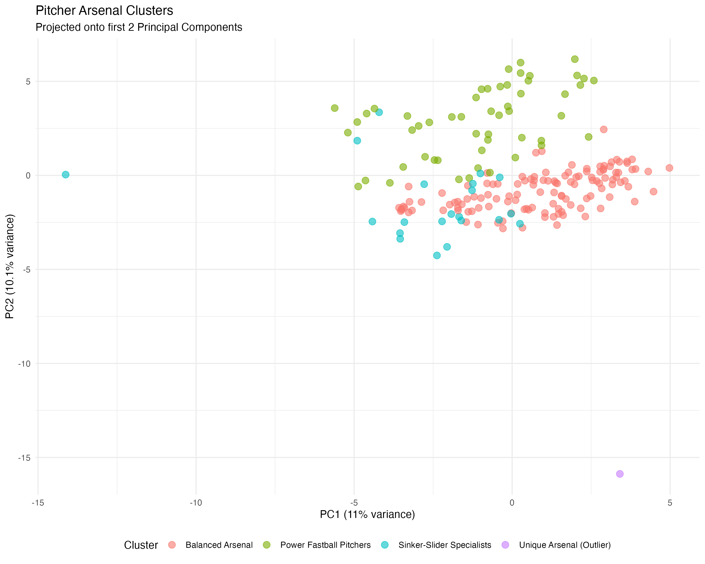
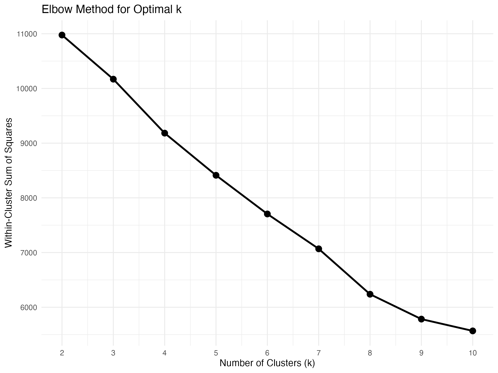
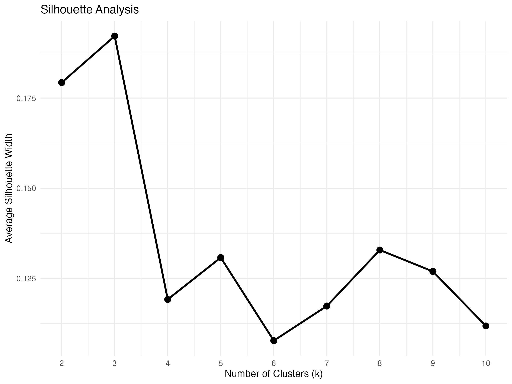

# Pitcher-Arsenal-Clustering
Use clustering algorithms (k-means) to group pitchers by their pitch mix, velocities, and movement profiles. Created a classification system for pitcher types.

## Project Overview
This project analyzes MLB pitcher arsenals using Statcast data and unsupervised machine learning to identify distinct pitcher types based on their pitch characteristics. By clustering pitchers according to their pitch mix percentages, velocities, spin rates, and movement profiles, we discovered meaningful patterns in how pitchers approach the game.

## Methodology

### 1. Data Collection
- **Source**: Baseball Savant Statcast data (April 2024)
- **Scope**: 24,992 pitches from 201 qualified pitchers (minimum 50 pitches)
- **Key Variables**: 
  - Pitch type classifications (FF, SI, SL, CH, CU, FC, ST, etc.)
  - Release speed and spin rate
  - Pitch movement (horizontal and vertical break)

### 2. Feature Engineering
For each pitcher, we calculated:
- **Pitch Mix**: Percentage of each pitch type thrown
- **Velocity Metrics**: Average speed by pitch type
- **Spin Characteristics**: Average spin rate by pitch type
- **Movement Profiles**: Average horizontal (pfx_x) and vertical (pfx_z) movement

This resulted in **60 features** per pitcher for clustering analysis.

### 3. Clustering Analysis
- **Algorithm**: K-means clustering
- **Preprocessing**: Standardized all features (mean=0, sd=1)
- **Optimal k Selection**: 
  - Elbow method analysis (k=2 to k=10)
  - Silhouette score analysis
  - Selected **k=4** based on interpretability and metrics

### 4. Cluster Validation
- Within-cluster sum of squares decreased steadily
- Silhouette scores indicated well-separated clusters
- PCA visualization confirmed distinct groupings

## Results: Four Pitcher Types Identified

### 1. **Balanced Arsenal** (126 pitchers, 63%)
**Characteristics**:
- Moderate 4-seam fastball usage (32.5%)
- Good mix of secondary pitches (17.2% sliders, 15.1% changeups)
- Average fastball velocity: 93.5 mph
- Most common pitcher type

**Notable Examples**: Justin Verlander, Charlie Morton, Chris Sale, Tyler Anderson

**Profile**: Traditional starters with diverse pitch mixes who keep hitters off-balance with variety rather than specializing in one approach.

---

### 2. **Power Fastball Pitchers** (53 pitchers, 26%)
**Characteristics**:
- HIGH 4-seam fastball usage (38.9%)
- HIGHEST average velocity (94.3 mph FF, 93.5 mph SI)
- Lower reliance on sinkers (9.7%)
- Moderate breaking ball usage (11.4% sliders, 7.3% curveballs)

**Notable Examples**: Zack Wheeler, Kevin Gausman, Ryne Stanek, Hunter Greene, Michael Kopech

**Profile**: Hard-throwing pitchers who attack hitters with high-velocity 4-seam fastballs at the top of the zone. Often feature upper-90s velocity.

---

### 3. **Sinker-Slider Specialists** (21 pitchers, 10%)
**Characteristics**:
- VERY LOW 4-seam usage (0.8%)
- HIGH sinker usage (32.8%)
- Significant slider usage (19.5%)
- Emphasize horizontal movement

**Notable Examples**: Marcus Stroman, Logan Webb, Tanner Houck, Cristopher Sánchez

**Profile**: Ground-ball pitchers who work down in the zone with sinkers and break bats with sliders. Focus on weak contact rather than swing-and-miss.

---

### 4. **Unique Arsenal** (1 pitcher, 0.5%)
**Characteristics**:
- Outlier cluster
- Balanced sinker/4-seam mix (26% each)
- Notable curveball usage (26.8%)

**Example**: Nick Lodolo

**Profile**: Statistical outlier with an unusual pitch mix that doesn't fit standard archetypes.

## Visualizations

### Cluster Separation (PCA)

The PCA plot shows clear separation between clusters:
- **PC1 (11% variance)**: Primarily distinguishes power fastball pitchers (right) from sinker-slider specialists (left)
- **PC2 (10.1% variance)**: Separates balanced arsenals (bottom) from specialized approaches (top)
- Nick Lodolo appears as a clear outlier in the bottom-left

### Model Selection
- **Elbow Plot**: Shows diminishing returns after k=4

- **Silhouette Analysis**: Peak at k=3, but k=4 provides better interpretability

## Key Insights

1. **Most pitchers use balanced approaches** (63%), suggesting versatility is valued in modern baseball
2. **Power fastballs are increasingly common** (26%), reflecting the emphasis on high-velocity pitching
3. **Sinker-slider specialists are rare** (10%), making them a unique archetype
4. **Clear separation exists** between pitch-to-contact (sinker) and pitch-to-miss (4-seam) philosophies
5. **Velocity differences** between clusters are meaningful but moderate (90-94 mph range)

## Data Source

Data obtained from Baseball Savant, MLB's official Statcast database.

Note: This analysis uses April 2024 data as a proof of concept. Cluster memberships may vary with larger datasets or different time periods.
